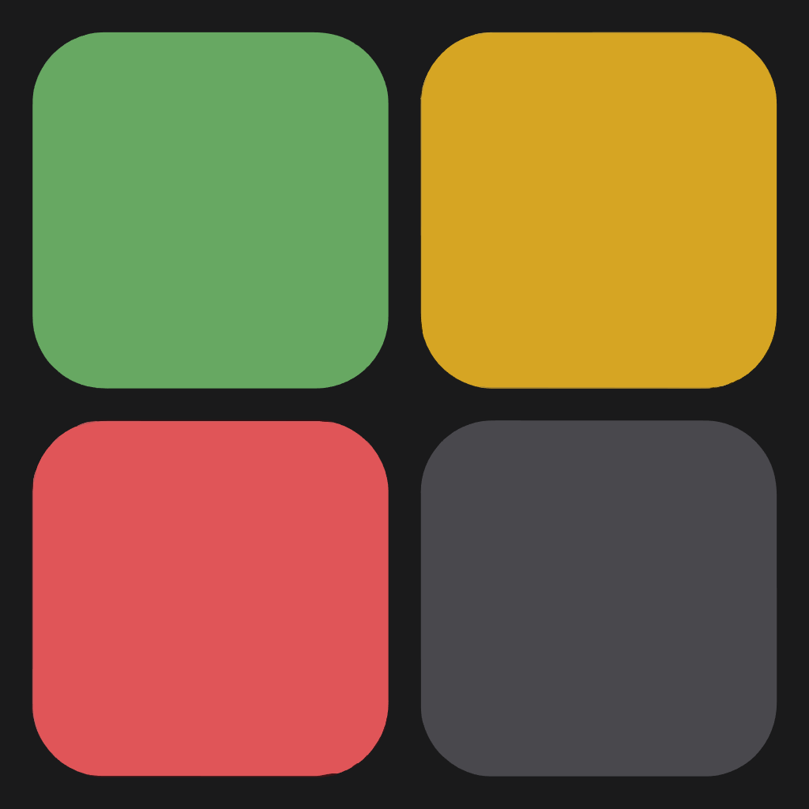

<p align="center">
  
</p>

<h1 align="center">Wordle hub</h1>

<p align="center">
  A Wordle playground with dozens of variants, custom games, and a personal hub.
</p>

<p align="center">
  
  
  
  
</p>

Wordle hub is a browser app for playing **classic Wordle** and a large catalog of twists — memory modes, multi-board, swap puzzles, ladders, and more. Guests can jump in immediately. Signing in unlocks a personal hub, the custom-game builder, and saved settings.

Inspired by [Wordle](https://www.nytimes.com/games/wordle); not affiliated with the New York Times.

## Features

- **Browse & play** — catalog of variants grouped by type (classic, visibility, constraints, board mods, puzzles, swap grids, multi-board)
- **My hub** — pin favorites with saved word length and ladder options
- **Create** — build custom games (guess count, timers, ladders, custom word lists, hard-mode rules) and test them before saving
- **Flexible play** — word lengths 2–12, ladder sessions that grow or shrink, multi-round runs
- **Appearance** — light and dark themes, plus a red–green colorblind tile palette
- **Client-side save** — hub pins, presets, and preferences stay on this device

## Modes

| Category | Examples |
| --- | --- |
| Classic | Classic, Zen, Infinite |
| Visibility | Colorless, Word 500, Memory colors / letters |
| Constraints | Banned, Forced letter, Locked letter, Doubles |
| Board mods | Wildcard, Spaces, Misleading tile, Repeat |
| Puzzle | Reverse, Word chain, Unscramble, Alternating |
| Swap | Square, Waffle, Plus, Cross |
| Multi | 2–8 boards at once |

Most modes also support **ladder** play (step through word lengths in one session).

## Tech stack

- **React 19** + **TypeScript**
- **Vite** for dev and production builds
- **React Router** for browse, play, create, and hub routes
- Custom game engines per variant (keyboard + grid UI shared across modes)
- Word lists from [12dicts](http://wordlist.aspell.net/12dicts/) (`3of6game`)

## Getting started

Requires [Node.js](https://nodejs.org/) 20 or later.

```bash
git clone https://github.com/prappleman/wordle-2.0.git
cd wordle-2.0
npm install
npm run dev
```

Open the URL Vite prints (usually `http://localhost:5173`).

| Script | What it does |
| --- | --- |
| `npm run dev` | Start the local app |
| `npm run build` | Typecheck and production build |
| `npm run preview` | Serve the production build |
| `npm run lint` | Run ESLint |

## Project layout

```
src/
  auth/          Sign-in gate for hub, create, and settings
  components/    Shared UI (grid, keyboard, cards, layout)
  game/          Per-variant engines and scoring
  hub/           Pinned shortcuts
  pages/         Routes: browse, play, create, settings
  variants/      Catalog, ladders, custom presets
  data/          Browse catalog + 12dicts word lists
```

## Acknowledgments

- Tile feedback language popularized by **Wordle** (Josh Wardle / NYT)
- Dictionary words from **12dicts** by Alan Beale

## License

[MIT](LICENSE) © Parker Rappleye
